# Deployment patterns

Where does each piece of an agent system run? This page first draws the
patterns any application faces, with no reference to oar, then shows where
`@botiverse/oar` sits in each one and which of them ship today. It is the
user-facing answer to
[hard problem 15](hard-problems.md#beyond-a-single-local-process): session,
process, and host are three different lifecycle layers, and every pattern
assigns each layer to an owner.

## Part 1: the patterns, independent of any library

### The four pieces

| Piece | What it is | Examples |
|---|---|---|
| **Application client** | The part of your product in the user's hands. It always runs on the user's own device. | A browser tab, a phone app, a desktop app, a terminal program |
| **Application server** | Your backend. Holds accounts and sessions for many users, and may or may not drive the agent. Pattern 1 has none in the session path. | A web backend, a task orchestrator, a chat platform's server |
| **Harness** | The agent loop: model calls, tool dispatch, context management, sub-agents. Owned by a vendor. | Claude Code, Codex, Grok Build, Kimi Code, Pi; a vendor's hosted agent API |
| **Environment** | Where commands run and files live. The tool side of the harness: a `bash` tool implies a Linux host somewhere. | A laptop, a container, a vendor sandbox |

Earlier drafts had one "application" piece. Splitting it into client and
server is what makes the patterns line up: the client is always on the
user's device, so it is never the thing that moves. What moves is the
harness, and the question is who drives it.

A dashed frame in a diagram means "one party provisions and manages
everything inside". The label names that party. Colors are constant across
every diagram: blue is the application (client or server), purple is the
harness, green is the environment, grey is a session endpoint or executor
that carries a connection, orange is oar.

### Three questions, three patterns

Start from the harness and ask who drives it and where it runs. Three
questions give three patterns, and every finer split lives inside one of
them.

1. **Does a server of yours drive the harness?** No: the client starts the
   harness on its own host, and there is nothing else in the session path.
   That is pattern 1. Yes: the harness is somewhere your server reaches
   over the network, and the next question applies.
2. **Whose machine does the harness run on?** A machine the user or
   customer owns and you did not provision: pattern 2. A host you
   provisioned, a vendor's service, or no machine at all: pattern 3.
3. **Inside pattern 3, who runs the harness?** You start a CLI or SDK on a
   host you provisioned (3.1). The harness exists only inside a vendor's
   service (3.2). You embed a library harness whose environment is a
   durable store, with no machine under it (3.3).

The client is not one of the questions. It sits on the user's device in
every pattern, and it matters to the shape in exactly two places: in
pattern 2 it may share the machine with the harness, and in 3.2b it may be
the thing that starts an executor on the user's machine. Everywhere else
the client only talks to your server and never touches the agent.

### The three axes

The three axes are the vocabulary for describing any pattern. They are not
a grid to fill in: most combinations of axis values are not a pattern. The
appendix at the end lays the grid out anyway, so that every combination
has a stated answer, including the empty ones.

**Axis A: who drives the harness, and where it runs.** This is the axis
the three questions above walk down.

- The client, on its own host. Pattern 1.
- Your server, over the network, on a machine the user or customer owns.
  Pattern 2.
- Your server, over the network, on a host you or a vendor provisioned,
  or on no host at all. Pattern 3.

**Axis B: what form the harness takes.** This decides where the harness
can physically run.

- A library inside the application's own process.
- A separate process on some host you or your user control.
- A vendor service with no local form at all.

**Axis C: where the environment is, relative to the harness.**

- Agent in the box: the harness runs commands on the host it lives on.
- Agent controls a box: the harness lives elsewhere and drives a separate
  sandbox over a connection.
- Agent over a store: there is no box. The environment is durable state
  (a file system, an object store, a per-agent database) plus functions
  over that state, each call running to completion somewhere the harness
  never sees. Pattern 3.3.

Axis C is not a free choice for the application. Whether a harness can
drive an environment other than its own host is a property of how the
harness was built, covered in [harness portability](#harness-portability)
below. Today the second value appears in practice only with vendor
services, and the third only with a harness embedded as a library.

**A fourth plane: who manages the environment lifecycle.** Once the
harness and the environment are separate boxes (axis C "controls a box"),
someone has to create the environment, connect it, and tear it down. That
is a decision of its own, and it does not follow from the other three
axes.

- Not managed. Agent in the box: the environment is the harness host,
  there is nothing to create or destroy per session. Patterns 1, 2, and
  3.1.
- Vendor-managed. The vendor's service provisions a sandbox per session
  and destroys it. Pattern 3.2a.
- Harness-managed. The harness itself provisions a box through some
  sandbox interface, whether it runs locally or hosted. No hosted vendor
  harness does this today. The shipped example is antiproton's container
  mount (pattern 3.3): the embedded harness creates the container the
  first time the agent opens it, and destroys it when the agent has
  nothing open, so it is released between turns.
- Externally connected. Your server, or the client on the user's own
  machine, provisions the box, and something inside it opens an outbound
  connection to the harness. The harness only borrows that connection; it
  never owns the lifecycle. Pattern 3.2b. Both vendors that ship this
  today chose it over harness-managed: rather than giving the hosted
  harness authority over your infrastructure, they punch a hole from your
  side.
- Dissolved. When the environment is a store plus functions (pattern
  3.3), a command runs in a container that exists for that one call and
  is gone afterwards. Nobody manages a lifecycle because nothing outlives
  the call. The question returns only when the agent needs a box that
  stays up, and then one of the rows above applies: harness-managed in
  antiproton, application-managed for Archil's Persistent Sandboxes.

Two of these rows can hold at once for one session. A product can give
the agent a vendor-managed box as its main environment and, whenever the
user's client is online, an externally connected executor on the user's
machine for a few local tools. The environment is then a cloud machine
plus an optional bridge on the user's side, and each half keeps its own
row. Pattern 3.2 describes this as 3.2a and 3.2b stacked.

### Pattern 1: the client drives the harness on its own host

Axis A client, axis B library or process, axis C agent in the box. No
server of yours is in the session path. The client starts the harness on
the machine it runs on, and tools run on that same machine. A vendor
account service (login, billing, sync) may exist and the harness may talk
to it, but it does not drive the session, so the pattern is unchanged.

The host can be a laptop, a CI runner, or a server of your own. Which one
does not change the pattern; what changes is who the "client" is. On a
laptop it is a person's terminal or desktop app. In CI it is the job
script. On a server it is a single-tenant tool whose users accept that
the agent's `bash` runs on that server, so sandboxing is the harness's job
or yours.

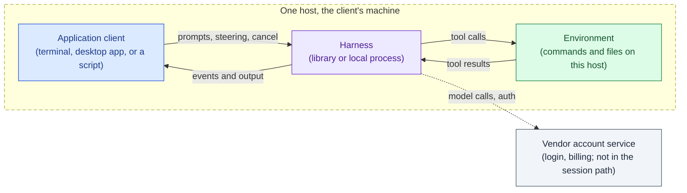

Typical applications:

- A terminal or desktop coding tool a developer runs on their own machine.
- A CI job that runs an agent inside the runner to fix, review, or migrate
  code and then exits.
- A single-tenant internal tool on one server, where the agent's shell
  access to that server is acceptable.
- Evaluation and batch scripts that drive many sessions on one box.

Several clients on one host are still pattern 1. `grok agent leader` is a
local Unix socket that a TUI, an IDE extension, and a headless CLI attach
to on one machine; the harness is driven locally, only by more than one
program.

### Pattern 2: your server drives a harness on a machine the user or customer owns

Axis A your server, on their machine; axis B local process; axis C agent
in the box. The harness is a CLI or SDK started on a machine your product
did not create and does not manage: the user's own laptop or desktop, or a
customer's own infrastructure ("bring your own compute"). Your server does
not know its address, usually cannot reach it (home NAT, corporate
firewall), and has no say in when it is up.

Two consequences follow, and they are what the pattern is about.

**The connection is dialed out.** Nothing can dial into the machine, so a
small daemon on it dials out to your server and holds that connection
open. Your server treats the connection as its channel to the agent: it
sends prompts, steering, and cancel down it, and receives events and
output up it. Who listens and who dials is a transport property; the
session protocol on top is the same as in 3.1, where the direction is
reversed.

**Your server is where the client and the daemon meet.** The client, on
whatever device the user holds, talks to your server. The daemon, on the
machine with the checkouts and credentials, also talks to your server. The
server pairs them, and neither side needs to reach the other directly.
That is why there is no separate "relay" in this pattern: the server is
the relay, and it is your application, not a piece of plumbing. Whether
the client sits on the same machine as the daemon or on another one is
the one way the client shapes this pattern:

- Same machine. The user runs your desktop app on their laptop and the
  daemon runs there too. Raft's Computer is this form: the member's
  desktop client and the member's agent daemon share the laptop, and both
  talk to the Raft server. The user still drives the agent through the
  server, so the shape is unchanged; only the network hop is short.
- Different machine. The user drives the laptop from a phone or a browser
  through your server. Remote control products are this form.

The new problem this pattern creates: the server can disconnect and
reconnect, the daemon can drop and redial, and several clients may want
to watch one session. If the daemon discards events while nobody is
attached, work is lost silently. The endpoint on the user's machine needs
a resumable cursor, the same requirement that 3.1 has.

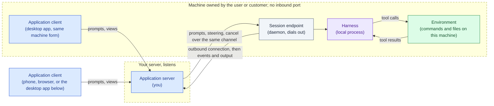

Typical applications:

- A coding agent product where the agent runs on the user's own computer
  and the user drives it from a phone or a web page (the "remote control"
  shape).
- A chat or collaboration platform whose agents run on members' own
  machines, with a small daemon on each machine that dials out to the
  server. Raft's own Computer is this shape.
- Enterprise deployments where the agent must run inside the customer's
  VPC and the customer allows outbound connections only.

Prior art: grok's headless mode, the default when `grok agent` runs with
no subcommand, dials out to `wss://code.grok.com/ws/code-agent`, and the
web frontend at grok.com/code drives the local agent through the grok
server. Kimi Code's remote control is an outbound WebSocket tunnel of the
same shape. Raft Computer dials out from a member's machine to the Raft
server. In all three the harness runs on the user's machine, the client
is a browser, a phone, or a desktop app, and the product never gets an
inbound port on the user's machine.

### Pattern 3: your server drives an agent on a host you or a vendor provide, or on no host

Axis A your server, on a host you or a vendor provisioned, or on none.
Every hosted product whose agent is not on the user's machine is here: a
cloud IDE, a task runner that turns issues into pull requests, an
assistant that costs nothing between messages. The client is a browser or
a phone talking to your server and nothing more, with one exception noted
in 3.2b. What separates the shapes inside the pattern is who runs the
harness, and then whether and where the agent has a machine.

1. **Who runs the harness?** You start a CLI or SDK on a host you
   provisioned (3.1). The harness exists only inside a vendor's service
   (3.2). You embed a library harness over a durable store, with no
   machine under it (3.3).
2. **Does the agent need a machine, and whose?** In 3.1 the machine is
   the harness host and it is yours. In 3.2 the vendor decides which
   environment shapes exist: a vendor sandbox (3.2a), a box you or the
   user connect (3.2b), or none (3.2c). In 3.3 there is no box at all.

#### 3.1: a CLI or SDK on a host you provision

Axis B local process, axis C agent in the box. The harness is a CLI or
SDK that you start on a machine you created and manage: a dev container
per user, a runner in your fleet, a sandbox rented from a vendor. Because
you created the host, your server knows its address and decides when it
starts and stops, so the simplest transport is an endpoint that listens on
the agent host and a server that connects to it. A host that must dial
out instead (a runner behind a firewall) is still 3.1; the listening form
is just the usual one.

Something on the agent host has to speak a session protocol; your server
connects to it, and the agent runs tools on that host. The server can
disconnect and reconnect, and several clients may watch one session
through it, so the endpoint needs a resumable cursor. This is the same
endpoint as in pattern 2 with the connection direction reversed, which is
why part 2 treats the two as one placement.

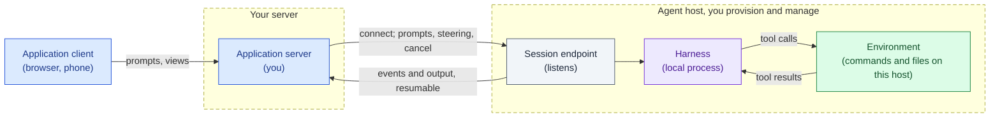

Typical applications:

- A web product whose backend gives each user a dev container and drives
  an agent inside it (the cloud IDE shape).
- A SaaS backend with a pool of agent workers it provisioned, scheduled
  like any other worker fleet.
- An internal platform where teams submit tasks and a scheduler places
  each session on a runner.

Prior art: `grok agent serve` is an inbound WebSocket listener that speaks
the same protocol as grok's stdio mode. It serves an IDE or a test harness
on the same machine or intranet, not a remote product, but it is the
endpoint shape this sub-pattern needs. It is not the path grok uses for
its own remote product, which is pattern 2.

#### 3.2: the harness inside a vendor's service

Axis B vendor service. The harness exists only inside the vendor's
infrastructure; there is nothing to install. Your server talks to the
vendor's API. Axis C is where this sub-pattern splits, and the split is
the vendor's design decision, not yours. The three shapes below are the
ones OpenAI's Agents API exposes as environment types; Claude Managed
Agents offers the first two (`cloud` and `self_hosted`). Both sets of
documentation were read 2026-09-12. Other vendors may offer only one.

3.2a and 3.2b are not exclusive for one product. A session can have a
vendor-managed box as its main environment and, whenever the user's
client is online, an executor on the user's machine for a few local
tools. The environment is then a cloud machine plus an optional bridge on
the user's side, and each half keeps its own lifecycle: the vendor manages
the box, the user's client manages the bridge. grok's bot is this shape:
a cloud agent usable from any device, with a computer in the cloud, and a
desktop app that can offer local tools while it is running.

##### 3.2a: vendor-hosted sandbox

The agent controls a box the vendor provisions. This is the vendor's own
architecture picture.

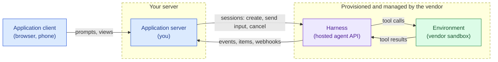

Typical applications:

- "Assign an issue, get a pull request" task runners: the server creates
  a session per issue and collects the result hours later.
- Chat bots that kick off background coding or research tasks and post
  the outcome when done.
- Batch migrations across many repositories, one session each, with no
  infrastructure of your own to run them on.

##### 3.2b: self-hosted environment

The agent controls a box that is not the vendor's: a container in your
VPC, a partner sandbox, or the user's own computer. You start the
vendor's executor inside it; the executor dials out to the vendor and the
harness runs tools through that connection. The environment lifecycle is
yours or the user's: the harness receives a connection and never creates,
resets, or destroys the box on the other end.

Whose box it is decides who starts the executor, and this is where the
client comes back into the picture:

- Your box. A container in your VPC or a partner sandbox; your server
  provisions it and starts the executor. The client is not involved.
- The user's own computer. Your desktop app starts the executor on the
  laptop. A hosted product then reaches the user's checkouts,
  credentials, and local tools without the harness leaving the vendor's
  service: the harness is hosted, the environment is the user's machine,
  and the connection is dialed out from the user's side by the client.
  This is the local half of grok's bot.

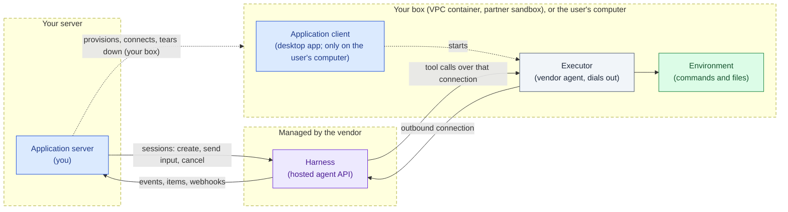

Note the resemblance to pattern 2: the executor is the same "dial out
from a box nobody can reach" shape, one layer down. In pattern 2 the
whole harness is on the user's machine and dials out to your server. Here
only the environment is on the user's machine and dials out to the
vendor's harness.

Typical applications:

- The same task runners as 3.2a, when the code, secrets, or internal
  services the agent needs live inside your VPC and cannot be copied into
  a vendor sandbox.
- Workloads that need a particular machine profile (GPU, memory, cold
  start, cost) and pick a partner sandbox for it.
- Agents that must act on a user's own machine while the harness stays
  hosted: a desktop app starts the executor on the laptop, and the hosted
  agent gets a bridge to local tools.
- Concretely: `codex exec-server` started inside your box, dialing out to
  the OpenAI Agents API with environment type `self_hosted`, while your
  server talks to the same session over the vendor API. Probed live in
  [runtimes/agents-api.md](../runtimes/agents-api.md).
- Concretely: an Anthropic environment worker (`ant` CLI or the
  `EnvironmentWorker` SDK class) running on your infrastructure, serving
  a Claude Managed Agents environment of type `self_hosted`.

Two vendors ship this shape and they chose different semantics for the
hole. The difference matters for how your server sizes and runs its side.

| | OpenAI Agents API `self_hosted` | Claude Managed Agents `self_hosted` |
|---|---|---|
| What runs in your box | `codex exec-server`, one per session | An environment worker, one per host or per sandbox |
| Connection model | Connect: the executor attaches to one session | Work queue: the worker polls the environment's queue over outbound HTTPS and claims sessions |
| Session with nobody connected | The input request itself blocks until an executor connects; the parked input then runs, but a client that drops the request loses it (observed) | Stays queued until a worker claims it |
| Sessions per connection | One | Many, sequentially, or a fresh sandbox per claimed session |
| Who decides the box per session | Your server, before it starts the executor | The worker, when it claims: run in place or spawn a container |
| Credential inside the box | Environment key | Environment key, never the API key |
| Wake-up | Your server starts the executor when it starts the session | Always-on polling, or a webhook on run start that triggers a worker |

The OpenAI shape is closer to pattern 2 one layer down: one box, one
outbound dial, one session. The Anthropic shape is a worker pool against
a queue, so one long-lived worker can serve many sessions and the
"provision a box" decision moves from your server into the worker. In
both, the lifecycle authority stays on your side and the harness only
ever sees a connection.

What "only a connection" means in practice, from the OpenAI probes in
[runtimes/agents-api.md](../runtimes/agents-api.md): the executor dying
mid-command surfaces as an environment disconnect plus a failed command
item inside a turn that still completes; a replacement executor started
against the same environment id reconnects and later commands run
through it; deleting the session leaves the executor process running;
and the credential the executor registers with is a restricted
environment key, not the project API key. Every one of those is the
harness declining lifecycle authority, which is the point of the
sub-pattern and also its cost: the box's supervision is entirely yours.

##### 3.2c: no environment

No sandbox anywhere. Every tool the harness wants is a function call back
into your server, which answers and returns the result. The call is
asynchronous: the harness parks in a requires-action state until you
answer, and that parked state belongs to the session, so your server has
to find it again after a restart. Vendors name these tools differently
(function tools at OpenAI, custom tools in Claude Managed Agents,
client-side tools in the Vercel AI SDK); oar calls them
runtime-to-application requests and binds the name to none of them.

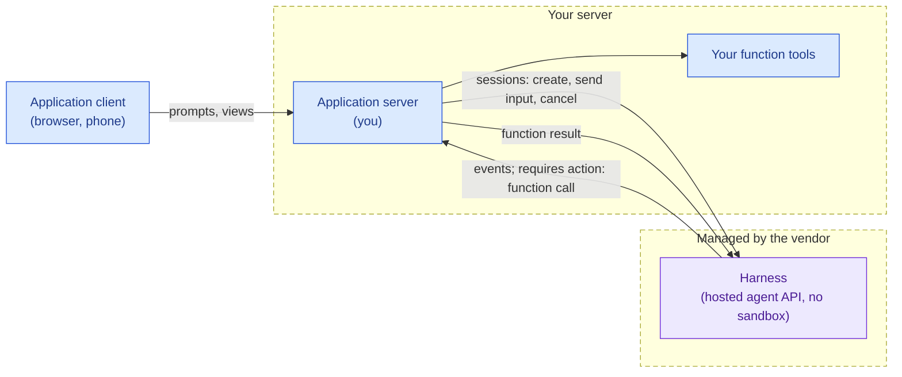

Typical applications:

- Support and operations assistants whose only tools are your own APIs:
  look up an order, open a ticket, update a record.
- Workflow agents over business systems (CRM, ticketing, calendars) with
  no file system in the picture.
- Any agent where letting a model run shell commands is not wanted, and
  every capability is a typed function you implement.

#### 3.3: a library harness over a store, with no machine

Axis B library, axis C agent over a store. The harness has no host to run
commands on and drives no box. The environment is a durable store (a file
system, an object store, a per-agent database) plus a set of functions
over it: read, write, search, run this command against it. Each function
call runs to completion somewhere the harness never sees, and nothing
exists between calls. That is the defining property, and it is about the
environment only.

Whether your server itself is serverless is a separate choice, and both
forms exist:

- 3.3a: your server and the harness are one serverless unit that wakes on
  an event, rebuilds its state from the store, takes a turn, and goes
  back to nothing. Idle costs nothing because nothing is running. This is
  antiproton, and it is the shape Archil calls "the file system is the
  agent".
- 3.3b: your server and the harness are an ordinary long-running process,
  and only the environment is serverless. Archil Serverless Execution
  used as a bash tool is this form. The server costs what any process
  costs; the saving is that no box exists for the agent.

The same shape with no server at all, a laptop process embedding the
harness and calling a store's functions as its tools, is pattern 1 with a
store as its environment. Nothing in pattern 1 changes; only the tools
do.

The diagram shows 3.3a. In 3.3b replace the dashed unit with a plain
process and drop the trigger.

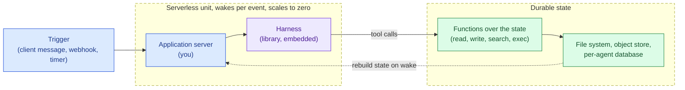

This is a third value on axis C, not a variant of 3.2c. In 3.2c the tools
are your server's own functions and the harness is a vendor service; the
agent has no workspace. In 3.3 the tools are functions over a store that
is the agent's workspace, and the harness is a library embedded next to
your server. The store outlives every process, so the store is the
identity of the agent: Archil's phrasing is that the file system is the
agent, and antiproton's is that state is a fold over an event log.

Typical applications:

- antiproton, a durable multi-tenant agent runtime on Cloudflare. One
  Durable Object per (tenant, agent) with its own SQLite; pi's harness
  runs inside the object and is driven one I/O pass at a time so the
  object can scale to zero while a model call is in flight. Tools are
  mounts (file, object store, HTTP) behind a policy gate, plus a sandbox
  that is a QuickJS or dynamic Worker with no network, no file system,
  and exactly one exit back to the tool gateway. A real container is "a
  mount, not the sandbox": created on demand, destroyed when the agent
  has nothing open.
- Archil Serverless Execution as a bash tool. A disk backed by your S3
  bucket, and `disk.exec(cmd)` runs each command in its own container to
  completion, billing only active time. The harness can be anywhere, a
  laptop or a cloud loop; its `bash` tool is a function over the disk.
  "The sandbox is a tool, not a place."
- The direction Archil calls "the file system is the agent": the harness
  code itself lives on the file system, is invoked by a REST call or a
  webhook as a serverless function or fluid compute, and the conversation
  history is data on the same file system, so a restart picks up exactly
  where the last turn ended.
- Long-lived assistants with many idle hours: one agent per user or per
  tenant that must cost nothing between messages and keep its memory,
  todos, and journal across months.

antiproton and Archil arrive at the same picture from opposite ends, and
they disagree on what the store and the functions are:

| | antiproton | Archil |
|---|---|---|
| Starting point | an agent runtime: embed the harness, then give it tools | a file system: add exec, then invoke the harness from the fs |
| The store | one event log per (tenant, agent) in its own SQLite; `state = fold(events)`; workspace data behind mounts | one multi-attach POSIX file system holding context, history, and eventually the harness code; humans and agents mount the same files |
| The functions | mounts plus a JavaScript sandbox with no network and no file system; a Linux container is "a mount, not the sandbox" | Linux itself: `exec` runs one container per command to completion; the interface stays bash, only the box goes away |
| A box that stays up | harness-managed: opened on demand, destroyed when nothing is open | never harness-managed: per-command in Serverless Execution, application create/stop/start in Persistent Sandboxes |
| Tenancy and secrets | inside the runtime: policy gate per mount, `secret_ref` dereferenced server-side, allowed hosts | outside: BYOC, container isolation, tenant split is yours |
| Status | the co-located harness is shipped and benchmarked | Serverless Execution and Persistent Sandboxes are shipped; "the file system is the agent" is a stated direction |

What it costs, honestly:

- Coding tasks still want a box. antiproton's own SWE-bench runs never
  used the JavaScript sandbox; every task went to the container mount,
  and the object was billed for about three quarters of wall clock while
  it waited on shell commands. Archil shipped Persistent Sandboxes (a
  real Linux box with an OCI image, vCPUs, memory, stop and start that
  keep files, snapshots, forks, preview URLs) because agent loops, dev
  servers, and processes that are expensive to start do not fit a one-off
  exec. 3.3 complements 3.2; it does not replace it.
- The harness must be a library whose tools and storage are interfaces.
  A CLI harness cannot be embedded this way, and a hosted vendor harness
  cannot be pointed at your store. Today that means pi, or a harness you
  write.
- Everything the agent reads must come through the functions. There is no
  ambient file system, no `cd`, no background process. Agents that lean on
  a shell for exploration lose their most fluent tool.

### Harness portability

Axis C looked like a free choice above. It is not. Whether a harness can
be moved between patterns is a property of how the harness was built, and
it decides which of the patterns are open to you with a given vendor.

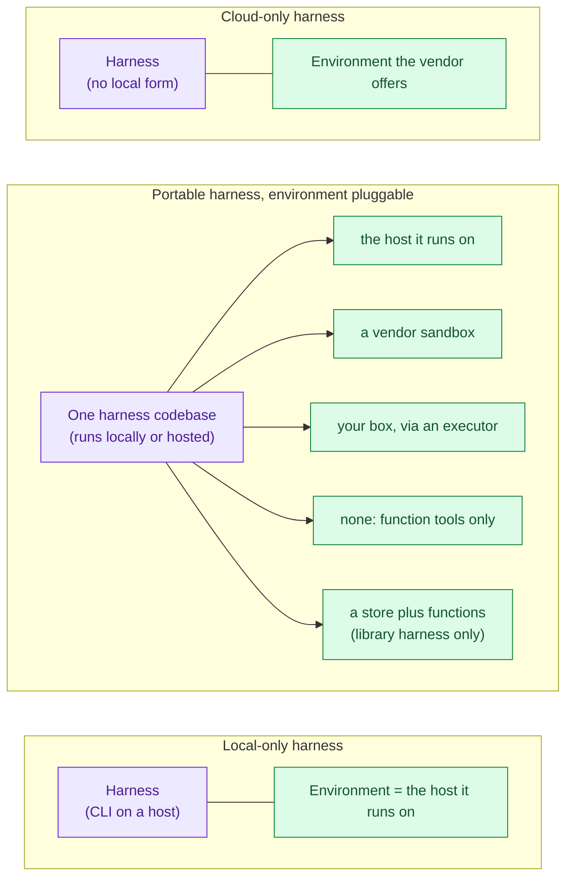

- **Local-only.** The harness is a CLI whose tools assume the host they
  run on. It can live in patterns 1, 2, and 3.1, always as "agent in the
  box". claude, grok, and kimi ship this way today. A hosted form of the
  same product, where one exists, is a separate harness with its own API.
- **Portable, environment pluggable.** One harness codebase runs as a
  local CLI and as a hosted agent, and its environment is a plug: the host
  it runs on, a vendor sandbox, your box through an executor, or none.
  codex is this: one codebase is the CLI in patterns 1, 2, and 3.1, and
  the harness behind the Agents API in 3.2, with environment types `none`,
  `openai_hosted`, and `self_hosted` mapping onto 3.2c, 3.2a, and 3.2b.
  The fifth plug, a store plus functions, needs the library seam below.
- **Library seam.** A harness shipped as a library whose tools and storage
  are interfaces can be embedded anywhere and pointed at any environment,
  including a store with no machine. pi is this: antiproton embeds pi's
  agent loop in a Durable Object and reimplements its `Storage`
  interfaces over the object's SQLite, with tools that are mounts. This
  is the only harness form that reaches 3.3.
- **Cloud-only.** The harness has no local form; you get whatever
  environment shapes the vendor offers. Claude Managed Agents is this,
  with `cloud` and `self_hosted` environments and the environment worker
  as the executor. Cursor's cloud agents are this with vendor sandboxes
  only.

Portability is a moving target. Vendors add hosted forms of local
harnesses and self-hosted executors for hosted ones; the axis values
above are what shipped at the time of writing, not a fixed property of
each vendor.

### Who owns which layer

The same five columns as the patterns, one row per lifecycle layer.
"You" is the application server; "the client" is the application client
on the user's device.

| | 1: client, one host | 2: their machine | 3.1: host you provision | 3.2: vendor service | 3.3: store plus functions |
|---|---|---|---|---|---|
| Host lifecycle | the client's machine; nobody creates it per session | the user or customer; you never create or destroy it | you (or a scheduler you run) | 3.2a the vendor; 3.2b you or the client; 3.2c nobody | the store outlives every process; compute exists per call |
| Harness process lifecycle | the client spawns and disposes | the daemon on their machine spawns; you drive it | the endpoint on your host spawns; you drive it | the vendor; you see sessions, not processes | the serverless unit (3.3a) or your process (3.3b) embeds it |
| Environment | the same host | the same machine | the same host | 3.2a vendor sandbox; 3.2b your box, or the user's computer via the client; 3.2c none | a store plus functions; a box only when opened, then harness-managed or application-managed |
| Harness credentials | on the client's machine | on their machine, theirs | on your host, yours | the vendor's; inside your box only an environment key | inside the unit, dereferenced server-side |
| Inbound network exposure | none | none on their side; your server listens | your host listens, or dials out | none on your side; the executor dials out | none; the unit is invoked by events |
| Recovery after the application disconnects | the harness process is gone with the client | the daemon keeps running; it needs a resumable cursor | the endpoint keeps running; it needs a resumable cursor | the vendor keeps the session; you resume with a cursor the vendor defines | nothing was running; the next event rebuilds state |

## Part 2: where oar sits

oar is the session interface: it turns a harness's native protocol into
one record stream with a dense `seq` cursor, and carries control (prompt,
steer, abort, dispose) the other way. Placement never changes that
contract. What changes is which process holds the oar library, which
side of a network hop the cursor crosses, and which lifecycle layers oar
owns versus observes. This part goes through the patterns of part 1 and
answers those three questions for each, with the shipped state named
honestly. The two places placement touches the protocol are the capability
declaration and the transport binding, and both are kept outside the
record-stream contract ([the spec](../spec/README.md)).

### Runtime classes on axis B

oar's shipped and designed runtimes fall on axis B like this:

| Class | Runtimes | How oar reaches the harness | Status |
|---|---|---|---|
| CLI subprocess | claude, codex, grok, kimi | oar spawns the process and speaks its stdio protocol | shipped |
| SDK in-process | pi | oar calls the library; the harness runs in oar's process (the library seam) | shipped |
| Cloud-only | Claude Managed Agents, Cursor cloud agents, OpenAI Agents API | oar is a client of the vendor API | designed, not shipped |

Three things follow from this table.

- Every shipped runtime is "agent in the box": the environment is the
  host oar runs on. That is what makes patterns 1, 2, and 3.1 the same
  runtime code with a different placement of oar.
- codex appears twice conceptually: as a CLI subprocess today, and as a
  possible cloud runtime through the Agents API. They would be two oar
  runtimes with two capability declarations, not one runtime with a
  switch, because the replay source and the environment model differ.
- pi is the only runtime that can be the harness in pattern 3.3, and the
  adapter is the same one used in pattern 1; what differs is who
  implements pi's storage and tool interfaces.

"Turn oar into a microservice of our own" is a placement of oar, not a
fourth runtime class. It is patterns 2 and 3.1 below.

### Pattern 1 with oar: shipped

oar is a library in the client's process. It spawns the CLI or calls the
SDK, owns the harness process lifecycle (spawn, `dispose`, exit as a
recorded fact, see [liveness.md](liveness.md)), and serves
`subscribe(observer, {sessionId, afterSeq})` from memory while the
process is alive. After the process dies, it rebuilds the record stream
from the runtime's own log when the runtime has one. oar does not own
storage; the application persists whatever it needs to outlive oar's
process.

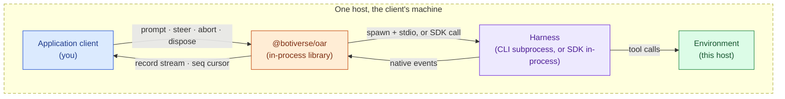

### Patterns 2 and 3.1 with oar: one service, designed, not shipped

Patterns 2 and 3.1 differ in who owns the harness host and in which side
opens the connection. They do not differ in what runs on that host: an
oar process that spawns the runtime and exposes the record stream over a
network transport. So there is one oar placement for both, the `oar serve`
launch mode, with a direction switch.

- On the agent host, `oar serve` runs the same library as pattern 1 with
  a transport in front of it. It owns the harness process lifecycle
  exactly as pattern 1 does. It either listens (3.1, your server
  connects) or dials out to an address you configure (2, the daemon on the
  user's machine reaches your server), and the session protocol is the
  same in both directions.
- In your server, an oar thin client speaks the protocol types and holds
  the cursor. It has zero runtime dependencies: no CLIs, no SDKs, no
  spawning. It subscribes with `afterSeq` and gets the same record stream
  a pattern 1 caller gets.
- The resumable cursor is what makes the hop safe. `seq` is dense per
  session, so any client can reconnect and ask for "everything after N"
  and either receive the gap or an explicit error that the gap is gone.
  See [the resumable cursor](../spec/session-graph-and-cursor.md#the-resumable-cursor).

```mermaid
flowchart LR
  UserClient["Application client<br/>(phone, browser, desktop app)"]:::app
  subgraph server["Your server"]
    direction LR
    App["Application server<br/>(you)"]:::app
    Client["oar thin client<br/>(protocol types + cursor, no runtimes)"]:::oar
    App --> Client
  end
  subgraph agenthost["Agent host: theirs (pattern 2) or yours (3.1)"]
    direction LR
    Service["@botiverse/oar<br/>(oar serve; dials out, or listens)"]:::oar
    Harness["Harness<br/>(CLI subprocess, or SDK in-process)"]:::harness
    Env["Environment<br/>(this host)"]:::env
    Service --> Harness
    Harness --> Env
  end
  UserClient -- "prompts, views" --> App
  Client -- "prompt · steer · abort · dispose" --> Service
  Service -- "record stream from afterSeq" --> Client
  style server stroke-dasharray: 6 4
  style agenthost stroke-dasharray: 6 4
  classDef app fill:#dbeafe,stroke:#1d4ed8,color:#1e3a8a
  classDef harness fill:#ede9fe,stroke:#6d28d9,color:#4c1d95
  classDef env fill:#dcfce7,stroke:#15803d,color:#14532d
  classDef oar fill:#ffedd5,stroke:#c2410c,color:#7c2d12
```

Why one service rather than a client adapter per runtime: one `oar serve`
covers every shipped runtime at once, because the service is the same
library that already speaks to all of them. A per-runtime remote adapter
would need each vendor's remote protocol to exist and to carry a cursor,
and today they mostly do not: `grok agent serve` had no resumable cursor
and discarded notifications when no client was attached
([hard problem 12](hard-problems.md)), which is exactly the silent loss pattern 2 and 3.1 must avoid.

The wire format of this transport is not decided in this document; see
[Not decided here](#not-decided-here).

### Pattern 3.2 with oar: vendor API client adapter, designed, not shipped

oar runs in your server as a client of the vendor's API. It does not own
the harness process; the vendor does. It owns the session view: it maps
the vendor's events, items, and webhooks onto the record stream, assigns
`seq`, and turns vendor "requires action" states into oar's
runtime-to-application requests
([record-stream.md](../spec/record-stream.md)) so that 3.2c function
tools and 3.2a or 3.2b sandbox sessions look the same to the application. The environment
(vendor sandbox, your box through an executor, or none) is the vendor's
and your infrastructure's concern; oar records what the vendor reports
about it and nothing more.

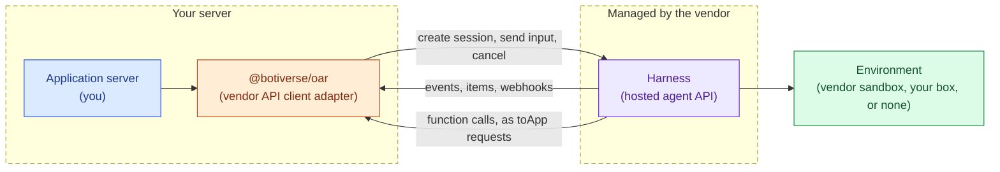

Each cloud adapter must declare, in its capability declaration, what it
can and cannot promise, because the vendor decides these and oar cannot
paper over them:

- **Replay source.** Whether records after a disconnect come from the
  vendor's own history API, from a webhook log the application keeps, or
  are unavailable, in which case `afterSeq` fails explicitly.
- **Sub-agent visibility.** Whether the vendor exposes sub-agent activity
  at all, and with what identity, so that
  [attribution](../spec/attribution.md) can be honest about what it
  knows.
- **Usage.** Best-effort, nullable, and mutable after the fact, because
  vendors report it at different times or not at all.
- **Blocked states as session facts.** A session waiting for an executor
  (3.2b), for a function result (3.2c), or for approval is recorded as a
  state of the session, not hidden inside the adapter.

The hybrid case in 3.2b where the executor runs on the user's machine is
covered by the probe in [runtimes/agents-api.md](../runtimes/agents-api.md):
the adapter holds the vendor session, and a separate local executor is
started in the working directory and killed on dispose, with two
credentials in play (the API key in your server, the environment key in
the box).

### Pattern 3.3 with oar: not tried

There is no new oar shape here. oar is the pattern 1 library embedded
next to pi, in whatever process the serverless unit or your long-running
process is. The differences are all around it:

- The host may end between two records. A serverless unit can be
  suspended mid model call, so oar's in-memory replay is not enough on
  its own; the record stream itself has to live in the store.
- Storage moves to the application. pi's `Storage` interfaces are what
  antiproton reimplements over Durable Object SQLite; oar's records would
  go the same way, and oar has no opinion on the store.
- oar has not been run on a Workers-style runtime. Whether its process
  and subprocess assumptions hold there is unverified.

### Who owns which layer, with oar in place

| | 1: library in the client | 2 and 3.1: oar service | 3.2: cloud adapter | 3.3: library in a serverless unit |
|---|---|---|---|---|
| Session lifecycle | oar | oar, on the agent host | oar's view; the vendor's truth | oar, rebuilt from the store |
| Harness process lifecycle | oar | oar serve | the vendor | oar, inside the unit |
| Host lifecycle | the client's machine | the user or customer (2), you (3.1) | the vendor, or your box (3.2b) | the platform, per event |
| Replay after disconnect | from memory, then the runtime log | from the service's cursor | as the adapter declares | from the store |
| Status | shipped | designed, not shipped | designed, not shipped | not tried; runtime compatibility unverified |

## Choosing

By scenario:

- A developer tool, a CI job, a script, or a single-tenant server tool:
  pattern 1. oar as a library, shipped today.
- A product whose agent runs on the user's own machine, driven from a
  phone or the web: pattern 2. `oar serve` dialing out, designed.
- A web product that gives each user a container or a runner you
  provision: 3.1. `oar serve` listening, designed, and the same service as
  pattern 2.
- A product with no infrastructure for agents, or one whose agent needs
  the vendor's sandbox or your VPC through an executor: 3.2. A cloud
  adapter per vendor, designed.
- One agent per user that must cost nothing while idle and keep its state
  for months, with a library harness: 3.3. Not tried.

By question:

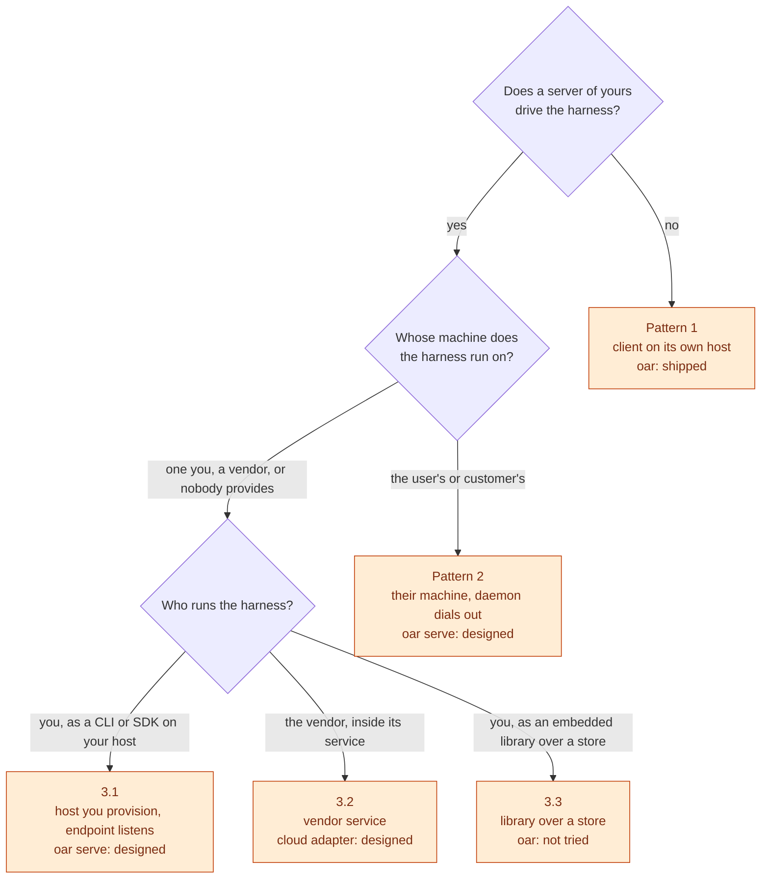

Routes to keep in mind:

- Never write a client adapter for a harness you could spawn. If the
  runtime has a CLI or SDK, pattern 1 through 3.1 already cover it with
  shipped code plus one service; a cloud adapter buys nothing there.
- 3.2 costs one adapter per vendor, each with its own capability
  declaration. Build one when a real consumer needs that vendor, not
  ahead of time.
- A portable harness (codex today) gives both routes: spawn it in 1, 2,
  or 3.1, or drive the vendor's hosted form in 3.2. Pick by who should
  own the host, not by the harness.
- Several clients on one session works in any pattern once a cursor
  exists; it pays off most in 2 and 3.1, where the cursor is the thing
  that makes reconnecting safe.
- The store pattern is open only to a library harness. Today that means
  pi; every CLI runtime is out.

## Not decided here

- The transport binding for `oar serve`: wire format, authentication,
  how a dialing-out endpoint is paired with a session on your server.
  That is a separate document, to be written when a real remote consumer
  exists.
- The typed capability surface a cloud adapter fills in (replay source,
  sub-agent visibility, usage, blocked states): also a separate document,
  to be written alongside the first real cloud adapter.

## Appendix: the axis grid

Every combination of axis A and axis C, with the pattern that lives there
or the reason none does.

| Axis A \ Axis C | Agent in the box | Agent controls a box | Agent over a store |
|---|---|---|---|
| The client drives the harness on its own host | Pattern 1 | No shipped harness does this locally; a local harness that drove a remote sandbox would be pattern 1 with a different tool set | Pattern 1 with a store as its tools; a library harness on a laptop calling a store's functions |
| Your server drives a harness on a machine the user or customer owns | Pattern 2 | Nothing here; if the harness is on their machine and drives a box elsewhere, the box is the interesting part and the machine is only a relay | Nothing here; a store needs no machine of theirs |
| Your server drives a harness on a host you or a vendor provide, or on none | 3.1 | 3.2a (vendor box), 3.2b (your box, or the user's computer via the client) | 3.3 |

Three things are not on the grid:

- 3.2c has no axis C value. It is "no environment", and it appears only
  with a vendor service.
- The fourth plane (who manages the environment lifecycle) cuts across
  the second column, and the 3.3a versus 3.3b split is about your own
  server's process, not about the agent. Neither is an axis.
- The split between pattern 2 and 3.1 is host ownership, which is part
  of axis A here but was once treated as a variant of one pattern. It
  moved up because it changes who dials whom and who holds the
  credentials, which is more than a variant.
