# Deployment patterns

Where does each piece of an agent system run? This page first draws the
patterns any application faces, with no reference to oar, then shows where
`@botiverse/oar` sits in each one and which of them ship today. It is the
user-facing answer to
[hard problem 15](hard-problems.md#beyond-a-single-local-process): session,
process, and host are three different lifecycle layers, and every pattern
assigns each layer to an owner.

## Part 1: the patterns, independent of any library

### The three pieces

| Piece | What it is | Examples |
|---|---|---|
| **Application** | Your code. Starts sessions, sends prompts, renders what comes back, decides what to do next. | A chat UI, a task orchestrator, a CI job |
| **Harness** | The agent loop: model calls, tool dispatch, context management, sub-agents. Owned by a vendor. | Claude Code, Codex, Grok Build, Kimi Code, Pi; a vendor's hosted agent API |
| **Environment** | Where commands run and files live. The tool side of the harness: a `bash` tool implies a Linux host somewhere. | A laptop, a container, a vendor sandbox |

A dashed frame in a diagram means "one party provisions and manages
everything inside". The label names that party. Colors are constant across
every diagram: blue is the application, purple is the harness, green is the
environment, orange is oar.

### The three axes

Each pattern below is an application shape that exists in practice. The
patterns are grouped by scenario, and there are two: the application and
the agent share one host, or the application is on a server and the agent
is somewhere else. The second scenario holds patterns 2, 4, and 5, and
what separates them is technical route, not what the product does; the
chapter opening lists the questions that tell the routes apart. The three
axes are the vocabulary for describing any pattern. They are not a grid
to fill in: most combinations of axis values are not a pattern. The
appendix at the end lays the grid out anyway, so that every combination
has a stated answer, including the empty ones.

**Axis A: where the application is, relative to the agent.**

- Local client, local agent: everything on one host.
- Remote application, local agent: your server drives an agent that runs
  on a host you provision, or on a machine someone else owns.
- Application drives a cloud agent that exists only inside a vendor's
  service. The application is usually remote here; a local application can
  do it too, but there is little reason to.

**Axis B: what form the harness takes.** This decides where the harness
can physically run.

- A library inside the application's own process.
- A separate process on some host you or your user control.
- A vendor service with no local form at all.

**Axis C: where the environment is, relative to the harness.**

- Agent in the box: the harness runs commands on the host it lives on.
- Agent controls a box: the harness lives elsewhere and drives a separate
  sandbox over a connection.
- Agent over a store: there is no box. The environment is durable state
  (a file system, an object store, a per-agent database) plus functions
  over that state, each call running to completion somewhere the harness
  never sees. Pattern 5.

Axis C is not a free choice for the application. Whether a harness can
drive an environment other than its own host is a property of how the
harness was built, covered in [harness portability](#harness-portability)
below. Today the second value appears in practice only with vendor
services, and the third only with a harness embedded as a library.

**A fourth plane: who manages the environment lifecycle.** Once the
harness and the environment are separate boxes (axis C "controls a box"),
someone has to create the environment, connect it, and tear it down. That
is a decision of its own, and it does not follow from the other three
axes.

- Not managed. Agent in the box: the environment is the harness host,
  there is nothing to create or destroy per session. Patterns 1 and 2.
- Vendor-managed. The vendor's service provisions a sandbox per session
  and destroys it. Pattern 4a.
- Harness-managed. The harness itself provisions a box through some
  sandbox interface, whether it runs locally or hosted. No hosted vendor
  harness does this today. The shipped example is antiproton's container
  mount (pattern 5): the embedded harness creates the container the first
  time the agent opens it, and destroys it when the agent has nothing
  open, so it is released between turns.
- Externally connected. The application, or a client on the user's own
  machine, provisions the box, and something inside it opens an outbound
  connection to the harness. The harness only borrows that connection; it
  never owns the lifecycle. Pattern 4b. Both
  vendors that ship this today chose it over harness-managed: rather than
  giving the hosted harness authority over your infrastructure, they
  punch a hole from your side.
- Dissolved. When the environment is a store plus functions (pattern 5),
  a command runs in a container that exists for that one call and is gone
  afterwards. Nobody manages a lifecycle because nothing outlives the
  call. The question returns only when the agent needs a box that stays
  up, and then one of the rows above applies: harness-managed in
  antiproton, application-managed for Archil's Persistent Sandboxes.

Two of these rows can hold at once for one session. A product can give
the agent a vendor-managed box as its main environment and, whenever the
user's client is online, an externally connected executor on the user's
machine for a few local tools. The environment is then a cloud machine
plus an optional bridge on the user's side, and each half keeps its own
row. Pattern 4 describes this as 4a and 4b stacked.

### One host: pattern 1

The application and the agent run on the same machine. There is one
pattern here. The variation is inside it: the host can be a laptop, a CI
runner, or a server, and the harness can be a library or a process.

#### Pattern 1: everything on one host

Axis A local, axis B library or process, axis C agent in the box. The host
can be a laptop, a CI runner, or an application server; the pattern is the
same. Putting the agent on an application server means its `bash` runs on
that server, so sandboxing is the harness's job or yours.

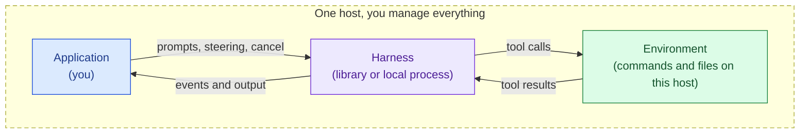

Typical applications:

- A terminal or desktop coding tool a developer runs on their own machine.
- A CI job that runs an agent inside the runner to fix, review, or migrate
  code and then exits.
- A single-tenant internal tool on one server, where the agent's shell
  access to that server is acceptable.
- Evaluation and batch scripts that drive many sessions on one box.

### Remote application: patterns 2, 4, and 5

Your application runs on a server, and the agent runs somewhere else.
Every hosted product is in this scenario, whatever it does: a cloud IDE, a
task runner that turns issues into pull requests, a chat platform whose
agents act on members' own machines, an assistant that costs nothing
between messages. What separates the patterns inside it is technical
route, not product type, and three questions tell the routes apart.

1. **Who runs the harness?** You start a CLI or SDK on some machine
   (pattern 2), the harness exists only inside a vendor's service
   (pattern 4), or you embed a library harness with no machine under it
   (pattern 5).
2. **Does the agent need a machine?** A box it runs commands on is the
   usual answer (2, 4a, 4b). Two routes drop the box: the tools are your
   own functions (4c), or the tools are functions over a durable store
   (5).
3. **Whose machine?** When there is a box, it is yours, the vendor's, or
   the user's or customer's own. This question splits pattern 2 into 2a
   and 2b, and it returns inside pattern 4 as the 4a versus 4b split.

#### Pattern 2: remote application, harness a process on another machine

Axis A remote application, axis B local process, axis C agent in the box.
The harness is a CLI or SDK that you or your user can start on a machine,
and that machine is not the one your application is on. Something on the
agent host has to speak a session protocol; the application connects to
it, and the agent runs tools on that host.

The new problem this pattern creates: the application can disconnect and
reconnect, and several clients may want to watch one session. If the
endpoint discards events while nobody is attached, work is lost silently.
The endpoint needs a resumable cursor.

Who owns the agent host splits the pattern in two, and the transport
direction follows from the answer. The session protocol on top is the
same in both.

##### 2a: a host you provision

The agent runs on a machine you created and manage: a dev container per
user, a runner in your fleet, a sandbox rented from a vendor. Because you
created the host, your server knows its address and decides when it
starts and stops, so the simplest transport is an endpoint that listens
on the agent host and a server that connects to it. A host that must dial
out instead (a runner behind a firewall) is still 2a; the listening form
is just the usual one.

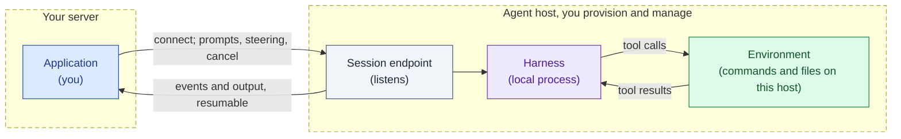

Typical applications:

- A web product whose backend gives each user a dev container and drives
  an agent inside it (the cloud IDE shape).
- A SaaS backend with a pool of agent workers it provisioned, scheduled
  like any other worker fleet.
- An internal platform where teams submit tasks and a scheduler places
  each session on a runner.

Prior art: `grok agent serve` is an inbound WebSocket listener that speaks
the same protocol as grok's stdio mode. It serves an IDE or a test harness
on the same machine or intranet, not a remote product. `grok agent leader`
is a local Unix socket that several clients (TUI, IDE extension, headless
CLI) attach to on one machine; that is pattern 1 with several clients,
but it has the same endpoint shape. Neither is the path grok uses for its
own remote product, which is 2b below.

##### 2b: a host the user or customer owns

The agent runs on a machine your application did not create and does not
manage: the user's own laptop or desktop, or a customer's own
infrastructure ("bring your own compute"). Your server does not know its
address, usually cannot reach it (home NAT, corporate firewall), and has
no say in when it is up.

Connection direction follows again. Nothing can dial into the host, so a
small daemon on it dials out to your application, and the application
treats that connection as its channel to the agent. Who listens and who
dials is a transport property; the session protocol on top is unchanged.

The main form of 2b today is personal or team use: a daemon runs on the
user's own computer, where their checkouts, credentials, and tools
already are, and the user drives it from a phone or a web page through
your server. Remote control products land here, because the agent needs
the user's machine and you do not provision that machine.

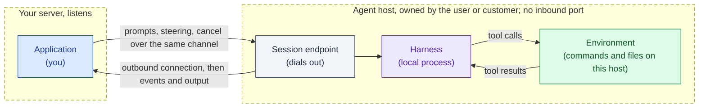

A relay is needed only when the driving side cannot listen either (a
browser tab or a phone, for example). Then both sides dial the relay and
it forwards between them. When the driver is your own backend, the agent
side dials it directly.

Typical applications:

- A coding agent product where the agent runs on the user's own computer
  and the user drives it from a phone or a web page (the "remote control"
  shape).
- A chat or collaboration platform whose agents run on members' own
  machines, with a small daemon on each machine that dials out to the
  server. Raft's own Computer is this shape.
- Enterprise deployments where the agent must run inside the customer's
  VPC and the customer allows outbound connections only.

Prior art: grok's headless mode, the default when `grok agent` runs with
no subcommand, dials out to a relay at `wss://code.grok.com/ws/code-agent`,
and the web frontend at grok.com/code drives the local agent through that
relay. The relay exists because the driver is a browser. Kimi Code's
remote control is an outbound WebSocket tunnel of the same shape. Raft
Computer dials out from a member's machine to the Raft server. In all
three the agent host is the user's machine and the product never gets an
inbound port on it.

#### Pattern 4: cloud-only harness

Axis B vendor service. The harness exists only inside the vendor's
infrastructure; there is nothing to install. The application talks to the
vendor's API. Axis C is where this pattern splits, and the split is the
vendor's design decision, not yours. The three shapes below are the ones
OpenAI's Agents API exposes as environment types; Claude Managed Agents
offers the first two (`cloud` and `self_hosted`). Both sets of
documentation were read 2026-09-12. Other vendors may offer only one.

4a and 4b are not exclusive for one product. A session can have a
vendor-managed box as its main environment and, whenever the user's
client is online, an executor on the user's machine for a few local
tools. The environment is then a cloud machine plus an optional bridge on
the user's side, and each half keeps its own lifecycle: the vendor manages
the box, the user's client manages the bridge. grok's bot is this shape:
a cloud agent usable from any device, with a computer in the cloud, and a
desktop app that can offer local tools while it is running.

##### 4a: vendor-hosted sandbox

The agent controls a box the vendor provisions. This is the vendor's own
architecture picture.

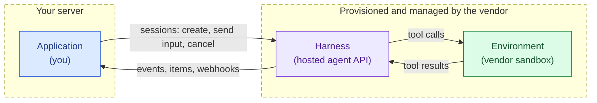

Typical applications:

- "Assign an issue, get a pull request" task runners: the application
  creates a session per issue and collects the result hours later.
- Chat bots that kick off background coding or research tasks and post
  the outcome when done.
- Batch migrations across many repositories, one session each, with no
  infrastructure of your own to run them on.

##### 4b: self-hosted environment

The agent controls a box you provision: a laptop, a container, a partner
sandbox. You start the vendor's executor inside it; the executor dials out
to the vendor and the harness runs tools through that connection. The
environment lifecycle is yours: the harness receives a connection and
never creates, resets, or destroys the box on the other end.

Whose machine the box is, the question that split pattern 2, returns
here. It can be a container in your VPC, and it can be the user's own
computer, with the executor started by a desktop app you ship. In that
second form a hosted product reaches the user's checkouts, credentials,
and local tools without the harness leaving the vendor's service: the
harness is hosted, the environment is the user's machine, and the
connection is dialed out from the user's side.

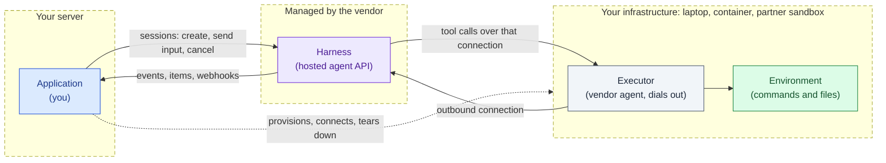

Note the resemblance to 2b: the executor is the same "dial out from a box
nobody can reach" shape, one layer down.

Typical applications:

- The same task runners as 4a, when the code, secrets, or internal
  services the agent needs live inside your VPC and cannot be copied into
  a vendor sandbox.
- Workloads that need a particular machine profile (GPU, memory, cold
  start, cost) and pick a partner sandbox for it.
- Agents that must act on a user's own machine while the harness stays
  hosted: a desktop app starts the executor on the laptop, and the hosted
  agent gets a bridge to local tools.
- Concretely: `codex exec-server` started inside your box, dialing out to
  the OpenAI Agents API with environment type `self_hosted`, while the
  application talks to the same session over the vendor API. Probed live
  in [runtimes/agents-api.md](../runtimes/agents-api.md).
- Concretely: an Anthropic environment worker (`ant` CLI or the
  `EnvironmentWorker` SDK class) running on your infrastructure, serving
  a Claude Managed Agents environment of type `self_hosted`.

Two vendors ship this shape and they chose different semantics for the
hole. The difference matters for how the application sizes and runs its
side.

| | OpenAI Agents API `self_hosted` | Claude Managed Agents `self_hosted` |
|---|---|---|
| What runs in your box | `codex exec-server`, one per session | An environment worker, one per host or per sandbox |
| Connection model | Connect: the executor attaches to one session | Work queue: the worker polls the environment's queue over outbound HTTPS and claims sessions |
| Session with nobody connected | The input request itself blocks until an executor connects; the parked input then runs, but a client that drops the request loses it (observed) | Stays queued until a worker claims it |
| Sessions per connection | One | Many, sequentially, or a fresh sandbox per claimed session |
| Who decides the box per session | The application, before it starts the executor | The worker, when it claims: run in place or spawn a container |
| Credential inside the box | Environment key | Environment key, never the API key |
| Wake-up | The application starts the executor when it starts the session | Always-on polling, or a webhook on run start that triggers a worker |

The OpenAI shape is closer to 2b one layer down: one box, one outbound
dial, one session. The Anthropic shape is a worker pool against a
queue, so one long-lived worker can serve many sessions and the
"provision a box" decision moves from the application into the worker.
In both, the lifecycle authority stays on your side and the harness only
ever sees a connection.

What "only a connection" means in practice, from the OpenAI probes in
[runtimes/agents-api.md](../runtimes/agents-api.md): the executor dying
mid-command surfaces as an environment disconnect plus a failed command
item inside a turn that still completes; a replacement executor started
against the same environment id reconnects and later commands run
through it; deleting the session leaves the executor process running;
and the credential the executor registers with is a restricted
environment key, not the project API key. Every one of those is the
harness declining lifecycle authority, which is the point of the
pattern and also its cost: the box's supervision is entirely yours.

##### 4c: no environment

No sandbox anywhere. Every tool the harness wants is a function call back
into your application, which answers and returns the result. In embedding
terms these are host functions: the harness is the guest, your application
is the host, and every tool is an import the host implements. Two
differences from the WebAssembly version: the call is asynchronous (the
harness parks in a requires-action state until you answer), and that
parked state belongs to the session. Vendors name them differently
(function tools at OpenAI, custom tools in Claude Managed Agents,
client-side tools in the Vercel AI SDK); oar calls them
runtime-to-application requests and binds the name to none of them.

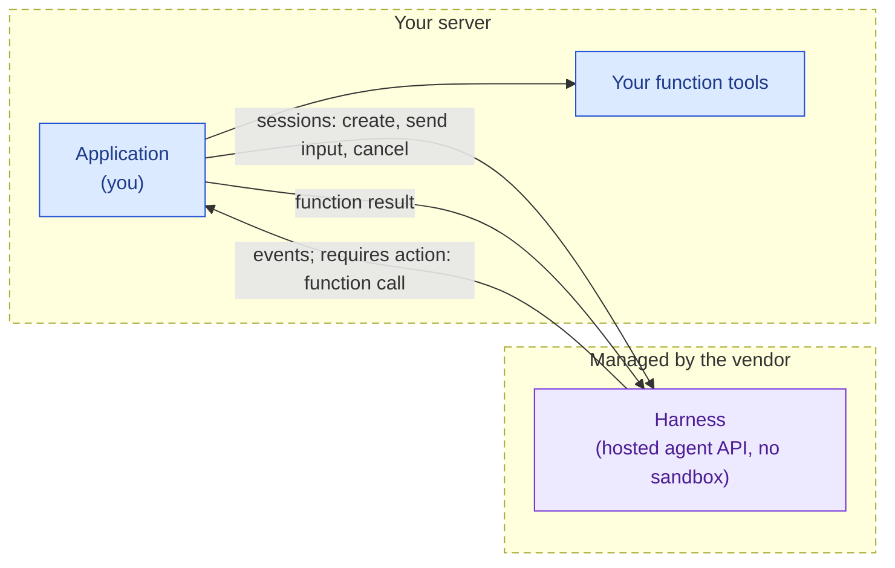

Typical applications:

- Support and operations assistants whose only tools are your own APIs:
  look up an order, open a ticket, update a record.
- Workflow agents over business systems (CRM, ticketing, calendars) with
  no file system in the picture.
- Any agent where letting a model run shell commands is not wanted, and
  every capability is a typed function you implement.

#### Pattern 5: environment as state plus functions, not a box

The harness has no host to run commands on and drives no box. The
environment is a durable store (a file system, an object store, a
per-agent database) plus a set of functions over it: read, write, search,
run this command against it. Each function call runs to completion
somewhere the harness never sees, and nothing exists between calls. That
is the defining property, and it is about the environment only.

Whether the application itself is serverless is a separate choice, and
both forms exist:

- 5a: the application and the harness are one serverless unit that wakes
  on an event, rebuilds its state from the store, takes a turn, and goes
  back to nothing. Idle costs nothing because nothing is running. This is
  antiproton, and it is the shape Archil calls "the file system is the
  agent".
- 5b: the application and the harness are an ordinary long-running
  process, on your server or on a laptop, and only the environment is
  serverless. Archil Serverless Execution used as a bash tool is this
  form. The application costs what any process costs; the saving is that
  no box exists for the agent.

The diagram shows 5a. In 5b replace the dashed unit with a plain process
and drop the trigger.

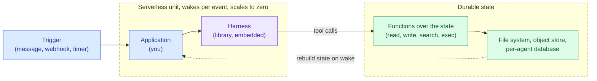

This is a third value on axis C, not a variant of 4c. In 4c the tools are
your application's own functions and the harness is a vendor service; the
agent has no workspace. In pattern 5 the tools are functions over a store
that is the agent's workspace, and the harness is a library embedded next
to the application. The store outlives every process, so the store is the
identity of the agent: Archil's phrasing is that the file system is the
agent, and antiproton's is that state is a fold over an event log.

Typical applications:

- antiproton, a durable multi-tenant agent runtime on Cloudflare. One
  Durable Object per (tenant, agent) with its own SQLite; pi's harness
  runs inside the object and is driven one I/O pass at a time so the
  object can scale to zero while a model call is in flight. Tools are
  mounts (file, object store, HTTP) behind a policy gate, plus a sandbox
  that is a QuickJS or dynamic Worker with no network, no file system,
  and exactly one exit back to the tool gateway. A real container is "a
  mount, not the sandbox": created on demand, destroyed when the agent
  has nothing open.
- Archil Serverless Execution as a bash tool. A disk backed by your S3
  bucket, and `disk.exec(cmd)` runs each command in its own container to
  completion, billing only active time. The harness can be anywhere, a
  laptop or a cloud loop; its `bash` tool is a function over the disk.
  "The sandbox is a tool, not a place."
- The direction Archil calls "the file system is the agent": the harness
  code itself lives on the file system, is invoked by a REST call or a
  webhook as a serverless function or fluid compute, and the conversation
  history is data on the same file system, so a restart picks up exactly
  where the last turn ended.
- Long-lived assistants with many idle hours: one agent per user or per
  tenant that must cost nothing between messages and keep its memory,
  todos, and journal across months.

antiproton and Archil arrive at the same picture from opposite ends, and
they disagree on what the store and the functions are:

| | antiproton | Archil |
|---|---|---|
| Starting point | an agent runtime: embed the harness, then give it tools | a file system: add exec, then invoke the harness from the fs |
| The store | one event log per (tenant, agent) in its own SQLite; `state = fold(events)`; workspace data behind mounts | one multi-attach POSIX file system holding context, history, and eventually the harness code; humans and agents mount the same files |
| The functions | mounts plus a JavaScript sandbox with no network and no file system; a Linux container is "a mount, not the sandbox" | Linux itself: `exec` runs one container per command to completion; the interface stays bash, only the box goes away |
| A box that stays up | harness-managed: opened on demand, destroyed when nothing is open | never harness-managed: per-command in Serverless Execution, application create/stop/start in Persistent Sandboxes |
| Tenancy and secrets | inside the runtime: policy gate per mount, `secret_ref` dereferenced server-side, allowed hosts | outside: BYOC, container isolation, tenant split is yours |
| Status | the co-located harness is shipped and benchmarked | Serverless Execution and Persistent Sandboxes are shipped; "the file system is the agent" is a stated direction |

What it costs, honestly:

- Coding tasks still want a box. antiproton's own SWE-bench runs never
  used the JavaScript sandbox; every task went to the container mount,
  and the object was billed for about three quarters of wall clock while
  it waited on shell commands. Archil shipped Persistent Sandboxes (a
  real Linux box with an OCI image, vCPUs, memory, stop and start that
  keep files, snapshots, forks, preview URLs) because agent loops, dev
  servers, and processes that are expensive to start do not fit a one-off
  exec. Pattern 5 complements pattern 4; it does not replace it.
- The harness must be a library whose tools and storage are interfaces.
  A CLI harness cannot be embedded this way, and a hosted vendor harness
  cannot be pointed at your store. Today that means pi, or a harness you
  write.
- Everything the agent reads must come through the functions. There is no
  ambient file system, no `cd`, no background process. Agents that lean on
  a shell for exploration lose their most fluent tool.

### Harness portability

The patterns above are the shapes an application can be in. Which shapes a
given harness can be in is decided by the harness's own design, and
harnesses fall into three groups, and a library harness is portable in a
second way that the diagram shows as its own plug.

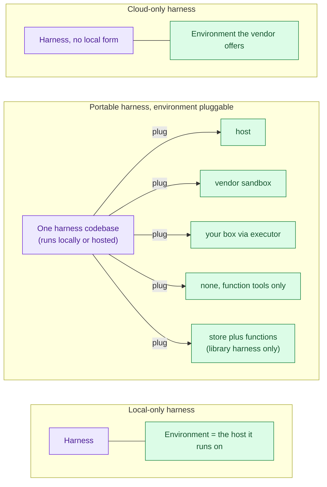

- **Local-only.** The harness runs tools on the host it lives on and has
  no seam between harness and environment. It moves only by moving the
  whole box, so it reaches remote applications through pattern 2, in
  either of its forms.
  As shipped today: claude, grok, and kimi as CLIs.
- **Portable, environment pluggable.** One harness codebase with the
  environment behind an interface. The same harness runs on a laptop with
  the host as its environment, or hosted by the vendor with a vendor
  sandbox, a box of yours reached through an executor, or no environment
  at all. Codex is the shipped example: the open-source Codex harness is
  both the CLI and the harness behind the Agents API, whose environment
  types are `none`, `openai_hosted`, and `self_hosted`, the last one
  served by `codex exec-server` dialing out from your box. Such a vendor
  can offer pattern 1 and all of 4a, 4b, 4c from one codebase.
  A library harness is portable by a different seam: pi ships with its
  tools and its `Storage` as interfaces, so the embedder chooses the
  environment. Embedded in a Node process it runs tools on that host
  (pattern 1); embedded in a Cloudflare Durable Object with mounts and a
  QuickJS sandbox as its tools it is pattern 5, which is exactly what
  antiproton does with no change to the harness. The seam is the tool
  interface rather than a vendor executor, so the library route reaches
  pattern 5 and the vendor route does not.
- **Cloud-only.** The harness has no local form; the vendor decides which
  environment shapes exist. As shipped today: Claude Managed Agents (4a
  as `cloud`, 4b as `self_hosted` through an environment worker) and
  Cursor's cloud agents.

Portability is why axis C exists as a choice at all: a vendor has to build
the seam before an application can pick a side of it. It is also a moving
target. A local-only harness can grow a seam in a later release, and a
cloud-only vendor can ship a local form. The patterns do not change when
that happens; a harness just becomes eligible for more of them.

### Who owns which layer

| | 1 · one host | 2a · host you provision | 2b · host the user or customer owns | 4 · cloud-only | 5 · state plus functions |
|---|---|---|---|---|---|
| Host lifecycle | you | you | the host's owner, not you | vendor (4a), you or the user (4b, the harness only borrows a connection), none (4c) | none per call; the harness or you, only for a box that must stay up |
| Harness process lifecycle | you, or a library you embed | the endpoint you put on the host | the daemon the owner installed | vendor | the serverless platform, per event |
| Environment | the harness host | the harness host | the harness host | vendor sandbox, your box, or none | a store you own plus functions over it |
| Harness credentials | on the host | on the agent host | on the agent host | vendor API key with the application; environment key inside your box (4b) | with the serverless unit; store credentials dereferenced server-side, never in the sandbox |
| Inbound network exposure | none | agent host listens, usually | none, agent host dials out | none, your side only dials out | the unit's trigger endpoint only |
| Recovery after the application disconnects | restart the process, or resume from the harness's own log | needs a resumable cursor on the endpoint | needs a resumable cursor on the endpoint | vendor history; live streams may not replay | the store is the state; the next wake rebuilds from it |

## Part 2: where `@botiverse/oar` sits

oar is the session interface: it turns a harness's native protocol into one
record stream with a dense `seq` cursor, and carries control (prompt,
steer, abort, dispose) the other way. Placement never changes that
contract. It changes only where oar runs and which network edge it
crosses. The two places placement touches the protocol are capability
declaration and transport binding, and both are kept outside the
record-stream contract ([the spec](../spec/README.md)).

### Runtime classes on axis B

| Class | Runtimes | Axis B form | Portability | How oar reaches it |
|---|---|---|---|---|
| CLI subprocess | claude, codex, grok, kimi | Separate process on a host with the binary installed and logged in | Local-only as a CLI; codex also exists in a hosted form (below) | Spawns it, talks over stdio |
| SDK in-process | pi | Library in the application's own Node process; light enough to live on an application server or a serverless object | Portable by the library seam: tools and `Storage` are interfaces, so the embedder picks the host (pattern 1) or a store plus functions (pattern 5) | Calls the SDK directly, no subprocess |
| Cloud-only | Claude Managed Agents, Cursor cloud, OpenAI Agents API | Vendor service | Vendor decides the environment shapes; the Agents API offers all three, Claude Managed Agents offers 4a and 4b | As a client of the vendor API (designed, not shipped) |

For every shipped runtime under oar today, the environment is the harness
host: claude, codex, grok, kimi run tools where the binary runs, and pi
runs them where the application runs. oar cannot split harness from
environment; it can only declare honestly which shape it is talking to. A
portable harness such as codex shows up in this table twice, once as a CLI
subprocess and once as a cloud-only service, and oar treats those as two
runtimes with two capability declarations, not one runtime with a switch.
pi's portability is different in kind: the embedder wires the tools, so
the same oar adapter sits over pattern 1 or pattern 5 without knowing
which; only the tools change.

"Turn it into a microservice of our own" is not a fourth class. It is a
placement of oar itself, pattern 2 below.

### Pattern 1 with oar: shipped

oar is an in-process library next to the application. It spawns a CLI
harness (or calls the SDK), owns that process's lifecycle (spawn,
`dispose`, recording its exit as a fact, see [liveness.md](liveness.md)),
and produces the record stream. While the process lives,
`subscribe(observer, {sessionId, afterSeq})` replays from memory; after it
dies, a resumed session rebuilds from the runtime's own log
([the resumable cursor](../spec/session-graph-and-cursor.md#the-resumable-cursor)).
oar does not own storage.

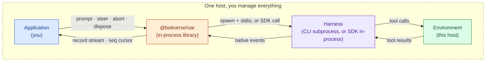

### Pattern 2 with oar: designed, not shipped

oar moves to the agent host and is started as a service (`oar serve`, a
launch mode of the same package). It is the "session endpoint" box from
part 1. The application holds a thin client with zero runtime
dependencies: protocol types and a cursor, nothing that spawns anything.
2b is the same service started on the user's own machine with an
outbound launch option; listening versus dialing is a transport binding,
not a protocol difference, so 2a and 2b are one placement of oar.

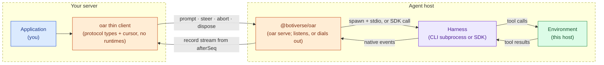

Why one service rather than a client adapter per runtime: any harness with
a CLI or SDK form is reached by deploying oar next to it, so one service
covers every shipped runtime with no per-vendor client code. The resumable
cursor is what makes this safe: several clients can attach to one session,
and a client that disconnects reconnects from its last `seq`. grok's own
serve mode lacked this (notifications were discarded while no client was
attached, hard problem 12); the cursor is the fix.

### Pattern 4 with oar: designed, not shipped

There is no host to put oar on, so oar stays with the application and its
adapter is a client of the vendor's API rather than a spawner. This is the
expensive tier: one new adapter per vendor, plus a capability declaration
of what that API cannot do. The application still sees the same record
stream it sees in pattern 1. Axis C sub-cases (4a, 4b, 4c) are the
vendor's shapes; the adapter records which one it sees. In 4b the
application, not oar, provisions the environment and runs the executor or
worker; oar only records that the session is waiting on, or attached to,
an environment connection. The one shipped reference for this shape,
[runtimes/agents-api.md](../runtimes/agents-api.md), sketches the
adapter as a hybrid: the session is remote, the executor is a local
process the adapter starts in `cwd` and kills on dispose, and two
credentials are in play. In 4c the harness's
function calls surface as runtime-to-application requests in the stream
([record-stream.md](../spec/record-stream.md)).

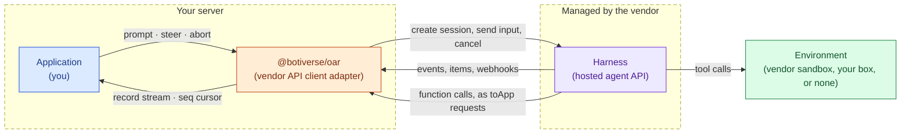

What the adapter must declare, from the Agents API documentation:

- **Replay source.** The vendor's live stream does not replay missed
  events; recovery rebuilds from saved items. So `afterSeq` here means a
  rebuild from vendor history, and the declaration names that source.
- **Sub-agent visibility.** The parent stream carries coordination items
  and a sub-agent id, not the full transcript. The session graph records
  what the vendor exposes and fabricates nothing
  ([attribution.md](../spec/attribution.md)).
- **Usage.** Best-effort, nullable, mutable. A progress signal, not a
  settlement figure.
- **Blocked states.** "Waiting on a function result" and "waiting on an
  environment connection" can last minutes. They are session facts,
  recorded as such.

### Pattern 5 with oar: pattern 1 in a different host, not tried

From oar's side there is no new shape. oar and the harness are a library
in the same process, exactly as in pattern 1, and the environment is
whatever tools the embedder hands the harness. There is no environment
connection to wait on, no executor, no worker; the record stream has
nothing new to say. The one thing pattern 5 changes is the host: a
serverless object that wakes per event and scales to zero, where the
process may end between two records of one session. That is a question
for the storage the harness and oar sit on, not for the protocol: oar
does not own storage, and the pi `Storage` interface is what antiproton
reimplemented on Durable Object SQLite to make pi run there. Whether
oar's own in-process path runs on a Workers-style runtime has not been
tried, and the honest status is exactly that.

### Who owns which layer, with oar in place

| | 1 · one host | 2 · oar service | 4 · cloud-only | 5 · state plus functions |
|---|---|---|---|---|
| Session lifecycle | oar in-process | oar service | vendor; oar mirrors it as records | oar in-process, inside the serverless unit |
| Harness process lifecycle | oar spawns and disposes | oar service on the agent host | vendor | the platform wakes and sleeps the unit; oar calls the SDK inside it |
| Host lifecycle | you | you (2a), or the host's owner (2b) | vendor (4a), you or the user (4b), none (4c) | none per call; the harness for a box it opens |
| Replay after disconnect | memory while alive, runtime log after death | cursor over the service | rebuilt from vendor history, declared | the store; whatever the embedder's storage keeps |
| Status | shipped | designed, not shipped | designed, not shipped | not tried; runtime compatibility unverified |

### Choosing

Start from the scenario, then answer the technical questions inside it.

- The application and the agent share one host (a desktop app, a CLI
  tool, a CI job): pattern 1.
- The application is on a server and the agent is elsewhere: patterns 2,
  4, and 5 are one scenario, and three questions pick the route.
  - Who runs the harness? A CLI or SDK you or your user start on a
    machine: pattern 2. A vendor's hosted service: pattern 4. A library
    harness with no machine under it: pattern 5.
  - Does the agent need a machine? A box it runs commands on: 2, 4a, 4b.
    Only your own functions as tools: 4c. Functions over a durable store
    as its workspace: 5, whether the application itself is serverless
    (5a) or a plain process (5b).
  - Whose machine? Yours: 2a, or 4b with your VPC. The user's or
    customer's own: 2b, or 4b with the executor on their computer. The
    vendor's: 4a. A cloud box plus an optional bridge to the user's
    machine is 4a and 4b stacked.

The flowchart below reaches the same answers from the harness side.

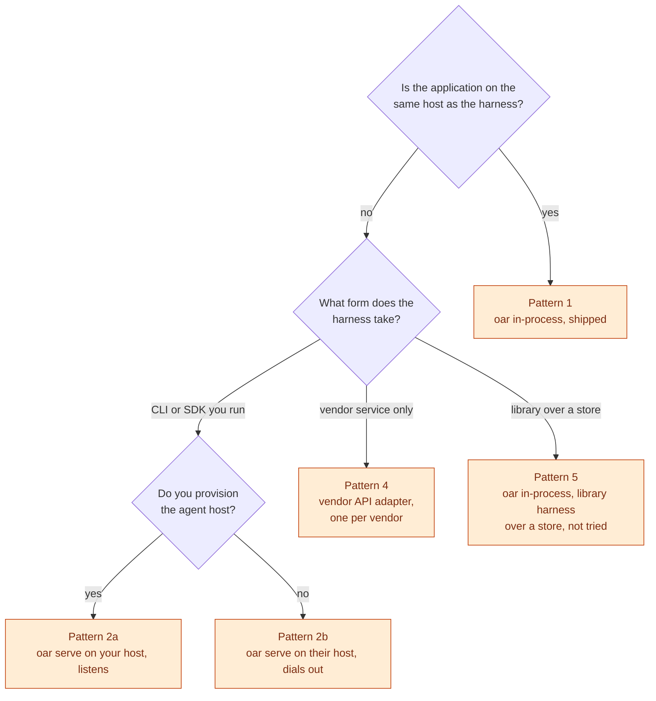

- The harness has a CLI or SDK form and you can put oar where it runs: use
  pattern 1, or pattern 2 when the application is elsewhere. Never write
  a client adapter for a harness you could spawn.
- The harness exists only as a vendor service: pattern 4 is the only
  route, and it costs one adapter per vendor. Build it when a real consumer
  needs that vendor, not before.
- A portable harness gives you both routes. Spawning its CLI is the cheap
  one and covers patterns 1 and 2; its hosted form is a separate runtime
  behind pattern 4.
- Several clients on one session, or a client that must survive its own
  restarts: any pattern, because the cursor is a protocol property.
  Pattern 2 is where it pays off most.
- The environment is a store plus functions, with no box for the agent:
  pattern 5, which from oar's side is pattern 1 with a library harness
  and different tools, whether the application is a serverless unit or a
  plain process. Only pi qualifies today.

### Not decided here

The wire format of the service in pattern 2 (transport binding) and
the typed capability surface pattern 4 relies on are separate documents,
to be written when a real remote consumer and a real cloud adapter exist.

## Appendix: the axis grid

The patterns are organized by scenario, and inside the hosted scenario by
technical route. This table takes a third route, axes first, and crosses
axis A (where the application is) with axis C (where the environment is). Every cell says which pattern it lands
on, or why no such shape exists today. Axis B (harness form) is noted per
cell, because it is mostly implied by the other two.

| | Agent in the box | Agent controls a box | Agent over a store |
|---|---|---|---|
| **Local client, local agent** | Pattern 1. Harness a library or a process. | None today. A process harness that drove a sandbox instead of running tools where it lives would sit here; no shipped harness does. | Pattern 5 with a local application (5b on a laptop). Harness a library. |
| **Remote application, local agent** | Pattern 2, as 2a or 2b. Harness a process. The split between them is host ownership, which is not an axis value. | None today, for the same reason as the cell above. | Pattern 5. 5a when the application and harness are one serverless unit, 5b when they are a plain process on your server. Harness a library. |
| **Application drives a cloud agent** | Not offered. A vendor harness never runs tools on its own service host; it always gets a box or none. | Pattern 4a when the vendor manages the box, 4b when you connect one. Harness a vendor service. | None today. No vendor harness can be pointed at a store you own. |

Three things are not on the grid:

- The 2a versus 2b split is host ownership: whether you provisioned the
  agent host or someone else owns it. Both read the same on the axes; the
  transport direction follows from ownership, not from an axis.
- Pattern 4c has no environment. The tools are your application's own
  functions and the agent has no workspace, so it has no value on axis C
  and no cell in the table. It is a vendor-service harness driven by an
  application, most often a remote one.
- The fourth plane, who manages the environment lifecycle, is a separate
  decision that opens once the environment is a separate thing. It
  distinguishes 4a from 4b inside a cell; it does not move anything between
  cells. The 5a versus 5b split is about the application's own process,
  serverless unit or plain process, and is not an environment question.
