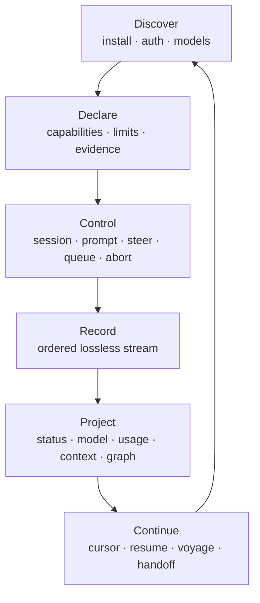

# OAR as an agent control system

OAR is a control plane and evidence substrate for agents that operate other
agents. Runtime adapters are replaceable edges of one coherent system.

An agent using OAR should always be able to answer: what is available, what is
true, what can I do, what happened, and how do I continue without guessing?
Those questions define the seams. Adapters supply native facts and controls;
contracts preserve meaning; observation helpers derive read models; hosts own
policy, storage, scheduling, and presentation.

## The six linked layers

- **Discover** is bounded: installation probing does not perform account I/O,
  and model/usage reads expose their authentication and resource cost.
- **Declare** is the decision surface. A capability is available, unavailable,
  or unknown for a stated reason; it never promises more than its interface
  proves.
- **Control** is explicit. Every action has a typed acceptance result and a
  known landing point; a rejection leaves the input with its caller.
- **Record** is the evidence boundary. One ordered stream preserves native
  payloads, attribution, and control obligations.
- **Project** is disposable read-model code. Status, liveness, usage, and UI
  views are folds over records and can be rebuilt without changing history.
- **Continue** is how work compounds: cursors, native resume identities,
  voyage logs, experiments, tests, and handoffs prevent rediscovery.

The arrows describe information dependencies, not a mandatory call sequence.
A host may discover once and run many sessions, subscribe before prompting, or
rebuild projections from a voyage log. Projections never become a second
source of truth, and adapters never depend on a host UI or storage engine.

## The agent operating loop

The ergonomic unit is a bounded control loop, not a single prompt:

1. **Orient:** read only the installation, model, capability, session, and
   cursor state needed for the decision. Prefer a narrow query to starting a
   session just to find out.
2. **Choose:** select a runtime and control using capability, evidence,
   latency, quota, and recovery policy. Keep the choice visible to the host.
3. **Act:** issue one explicit control action and inspect its typed response
   before assuming it landed.
4. **Observe:** consume the ordered stream; keep the native record for any
   decision that matters.
5. **Verify:** check the runtime's own completion, error, usage, and liveness
   facts. Silence is unknown, never success.
6. **Checkpoint:** persist a cursor or voyage artifact with runtime identity,
   model, capability decision, and evidence needed to replay the step.
7. **Handoff:** leave the next owner a session identity, cursor, and actionable
   next step, including any irrecoverable gap.

The loop is restartable. A crashed worker can replay and continue; another
worker can inspect the same evidence; a human can intervene at a control
boundary without reconstructing hidden adapter state.

## Agent ergonomics are invariants

- **Discoverability:** public names, docs, records, and errors answer what to
  do next. Typed `unsupported` includes a reason.
- **Inspectability:** meaningful state is queryable or reconstructible from
  records. Hidden mutable flags are an adapter smell.
- **Actionability:** outcomes say whether input was accepted, whether retry is
  sensible, and who owns the next decision. Never infer this from silence.
- **Composability:** shared mechanisms carry no runtime identity; runtime
  policy stays local; projections consume contracts only.
- **Reversibility:** controls are bounded and explicit; rejected input remains
  caller-owned; disposal and handoff are observable.
- **Resource awareness:** cheap probes precede expensive runs; real logins and
  model calls are deliberate; deadlines, cancellation, and quota remain
  visible.
- **Native reachability:** abstraction removes mechanism differences, not
  information. Native payloads remain reachable and vendor extensions stay
  behind explicit capability boundaries.

## How the system accumulates value

OAR is agent-accretive when each operation improves the next one:

- A stream becomes a voyage log or projection without losing source facts.
- A surprising behavior becomes an experiment, regression test, and mapping.
- A failed action leaves a typed rejection or honest gap, preventing repeats
  under a false premise.
- Capability and model decisions are data, so hosts can change runtimes without
  rewriting task history.
- Public contracts grow additively from evidence; unsettled semantics remain
  explicitly unknown or open.

The accumulation rule is: **leave a reusable artifact at every seam**. A run
leaves records; a probe leaves a script and conclusion; a design decision
leaves rationale; a handoff leaves identity, cursor, and next action.

## Ownership and boundaries

OAR owns adapter observation and the public meaning of records. The host owns
scheduling, policy, persistence, multi-controller arbitration, and human
presentation. A consumer may cache projections, but must be able to rebuild
them from the stream. A runtime may expose stronger native behavior than OAR
maps; that is evidence-backed follow-up, never permission to infer support.
