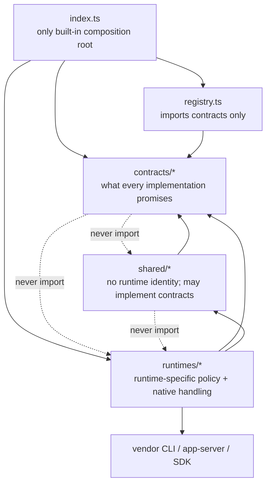

# Source layout

```text
src/
  index.ts                 # public exports + built-in composition
  registry.ts              # runtime collection and lookup
  contracts/               # provider-independent agreements
  runtimes/<id>/           # one runtime, split by capability
  shared/                  # provider-independent reusable mechanisms
```



- Simple capabilities use one behavior contract; add separate API/SPI contracts only when abstraction level or call direction differs.
- `runtimes/<id>/index.ts` declares that runtime's supported capabilities. Keep its parsing, compatibility policy, and protocol details nearby.
- Keep host dependencies as constructor inputs until multiple runtimes prove a stable shared boundary. Do not create empty architecture directories.
- `sea-trial/` owns shared behavior judgments; `drydock/` is their daemon-free RuntimeUnderTest vehicle; `drydock/probes/` is evidence, not conformance.
- Installation probing is local-only. Account usage is a separate authenticated observation capability.
- Draft contracts stay off the public surface: `contracts/session.ts` and `Runtime.session` are `@internal` scaffolds (stripped from published d.ts) until the design settles; `runtimes/*/session.ts` hold the adapter landing sites.
