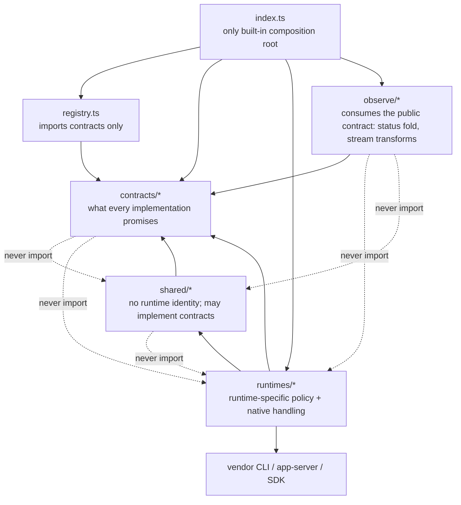

# Source layout

```text
src/
  index.ts                 # public exports + built-in composition
  registry.ts              # runtime collection and lookup
  voyage.ts                # oar-voyage/1 evidence log: line builders + recorder
  contracts/               # provider-independent agreements
  runtimes/<id>/           # one runtime, split by capability
  shared/                  # mechanisms + shared contract implementations
  observe/                 # consumer-side derivations over the event stream
```



- Simple capabilities use one behavior contract; add separate API/SPI contracts only when abstraction level or call direction differs. Say "runtime X passed the behavior tests", not "conformance" — one word, no ceremony.
- `runtimes/<id>/index.ts` declares that runtime's supported capabilities. Keep its parsing, compatibility policy, and protocol details nearby.
- Keep host dependencies as constructor inputs until multiple runtimes prove a stable shared boundary. Do not create empty architecture directories.
- Test layers: `tests/` = fast pure unit tests only. `sea-trial/` = contract behavior judgments (`cases/`), their engine and vehicle (`harness/`), the mock fixture (`fixtures/`), and the single entry `pnpm sea-trial` (part of `pnpm check`, so CI runs the mock instance) — backend picked by `OAR_TEST` (unset = mock; unavailable runtime = skip, OpenDAL semantics). `experiments/` = manual real-runtime experiment records (see its README inventory); never CI.
- Installation probing is local-only. Account usage is a separate authenticated observation capability.
- Behavior invariants live as comments on the exact contract member they constrain; every must/never has (or gets) a sea-trial case.
