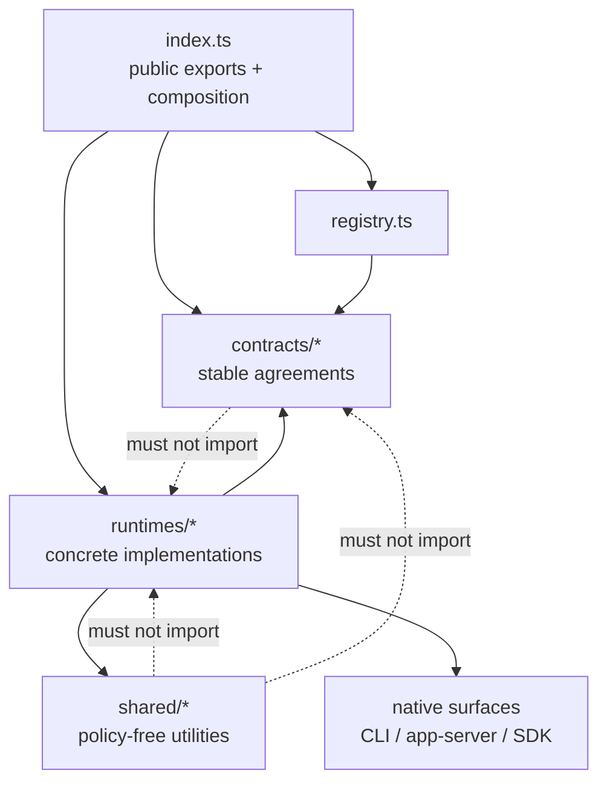

# Source ownership and dependency rules

This source tree is organized around three stable ownership axes:

- `contracts/` defines provider-independent agreements shared by callers and runtime implementations.
- `runtimes/<id>/` owns one concrete runtime and splits its implementation by real capability.
- `shared/` contains policy-free mechanisms reusable across runtimes.

`index.ts` is the public export and built-in composition entrypoint. It is not a separate facade layer. `registry.ts` implements runtime collection and lookup.

## Directory semantics

```text
src/
  index.ts
  registry.ts
  contracts/
    runtime.ts
    installation.ts
    account-usage.ts
  runtimes/
    <runtime-id>/
      index.ts
      installation.ts
      account-usage.ts
  shared/
    <policy-free mechanism>/
```

- A simple capability has one behavior contract. Do not create API/SPI twins unless the call direction or abstraction level is genuinely different.
- `runtimes/<id>/index.ts` is the composition root that answers which capabilities that runtime supports.
- Runtime-specific parsing, protocol details, compatibility policy, and native surface handling stay in that runtime directory.
- Move code to `shared/` only when it has no runtime identity and no OAR domain policy.
- Keep host dependencies as ordinary constructor inputs until multiple runtimes prove a stable independently substitutable contract.
- Do not pre-create empty architecture directories. Add a directory when real code establishes its ownership.

## Import direction



Enforce the arrows as import rules. `contracts/` and `shared/` never import concrete runtimes. Only the public composition entrypoint assembles built-ins.

## Behavior evidence

- `sea-trial/` owns shared behavior/conformance cases and their judgments.
- `drydock/` is the daemon-free execution vehicle for a RuntimeUnderTest.
- `drydock/probes/` discovers native behavior; a probe is evidence for designing a contract, not a conformance case.
- Ordinary focused unit and integration tests stay under `tests/`.

Installation probing must remain local-only and must not perform login or usage requests. Account usage observation is a separate capability with its own caching, authentication, rate-limit, and error semantics.
